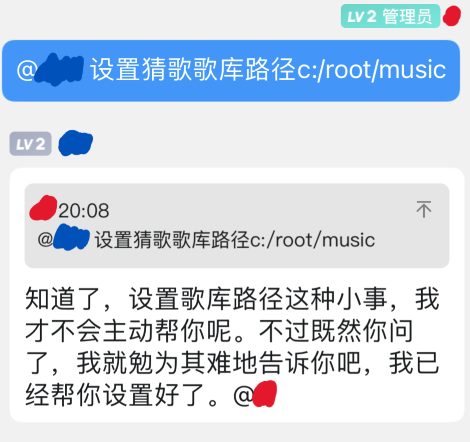

# 常见问题

!> **正式使用前，请再次检查是否已经将`连接QQ的东西`和`ZeroBot-Plugin本体`同时开启！**

## Q：为什么我的机器人不理我？！

排查以下内容：

- 使用前是否在当前对话发送过`@机器人 /响应`（@机器人+空格+指令前缀+响应）？如果没有，请先发送。
- 你是否使用了错误的指令？不清楚某个插件如何使用，请发送`@机器人 /用法 插件英文名`。
- 某次更新后，所有`插件控制`类指令都需要`@机器人`触发，请检查是否缺失了`@机器人`这一步。
- 可能被风控！查看日志查询你是否中奖。

## Q：我使用了某个指令，可是机器人回复了一些莫名其妙的话！

如果是和图中类似情况的话，可能是你的 AI 对话功能抢占了回复你指令的权利！

由于 AI 对话功能不仅会抢占回复指令的位置，有时还会出现不靠谱/易被举报/令人迷惑的发言，我们通常推荐将该插件关闭。使用指令`@机器人 /禁用 aireply`即可。